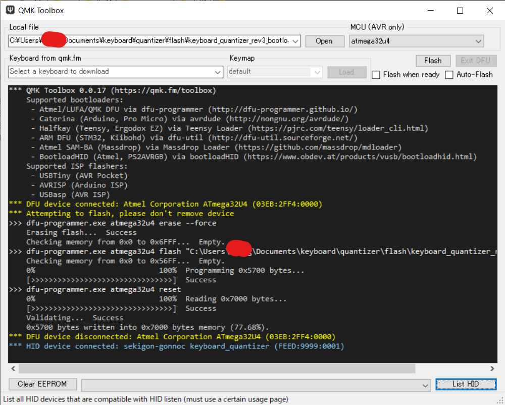

# Keyboard Quantizer ビルドガイド(Rev3)


- [販売リンク](#販売リンク)
- [はじめに](#はじめに)
- [組み立て手順](#組み立て手順)
  - [キット内容](#キット内容)
  - [組み立て](#組み立て)
  - [QMKファームウェアの書き込み](#qmkファームウェアの書き込み)
  - [ホスト用ファームの書きこみ](#ホスト用ファームの書きこみ)
  - [通常運用のファームウェアにもどす](#通常運用のファームウェアにもどす)
  - [動作確認](#動作確認)
  - [キーマップの書き換え](#キーマップの書き換え)
- [QMKファームウェア](#qmkファームウェア)
  - [キーマップ一覧](#キーマップ一覧)
  - [キーマップのオプション](#キーマップのオプション)
    - [レポートパーサの設定](#レポートパーサの設定)
    - [仮想シリアルポート](#仮想シリアルポート)
    - [LEDの制御](#ledの制御)
    - [ファームウェアを小さくする](#ファームウェアを小さくする)
    - [VIA対応](#via対応)
- [その他](#その他)
  - [ホスト用ファームの書きこみ方法2](#ホスト用ファームの書きこみ方法2)

## 販売リンク
- [BOOTH](https://nogikes.booth.pm/items/2256612)
- [遊舎工房](https://yushakobo.jp/shop/keyboard-quantizer/)

## はじめに
- よくある質問は[こちら](README.md#よくある質問)
- 組立済版を購入された方は[動作確認](#動作確認)に進んでください
- 未組立版を購入された方はこのまま読み進めてください

## 組み立て手順
### キット内容
本キットには以下の部品が入っています

|部品|数量|
|--|--|
|メイン基板(表面実装部品実装済み) |1
|USBプラグ |1
|USBレセプタクル |1
|ケース |1

### 組み立て
- USBコネクタをはんだ付けしてください
- ケース中央部の丸い出っ張りと基板の切り欠きの位置が合うようにケースに入れます
  - はんだ付けに自信がない場合は後述のファームの書き込みと動作確認後にケースを閉めたほうが手戻りが少なく済みます
  
- ケースを開けるときはマイナスドライバーなど薄いものを側面の隙間にいれてこじ開けてください
  - 鋭利な工具を使用する場合は怪我に注意してください

### QMKファームウェアの書き込み
- QMK Toolboxを使ってQMKファームウェアを書き込みます
  - もしあなたがQMKの扱い方を知っているのであれば、QMKファームウェアの章の方法で書き込むこともできます。DFUブートローダを使用しているため、dfu-programmerを管理者権限で実行しないと書き込めない場合があることに注意してください
  - **ProMicro Web Updaterは対応していません**
  
   - OSに合わせて[QMK Toolbox](https://github.com/qmk/qmk_toolbox/releases)をダウンロード
   - 書き込むファームウェアを用意する。最初の書き込みでは[keyboard_quantizer_rev3_bootloader.hex](https://github.com/sekigon-gonnoc/keyboard-quantizer-doc/releases/tag/0.3.1)
   - QMK Toolboxを起動し、Openボタンをクリックして用意したファームウェアを選択する
   - Keyboard QuantizerをPCに接続し
      ```
      *** DFU device connected: Atmel Corporation ATmega32U4 (03EB:2FF4:0000)
      ```
     という表示が出るのを確認する
     - 表示が出ない場合はデバイスマネージャやlsusbでUSBデバイスが認識されているか確認
       - 認識されている -> QMK Toolboxを再起動する、他の方法、PCで書き込む
       - 認識されていない -> USBコネクタのはんだ付けを確認する 
   - Flashボタンを押して完了を待つ

### ホスト用ファームの書きこみ
- [CH559 Web Updater](https://sekigon-gonnoc.github.io/ch559-web-updater/)を使ってUSBホストICのファームを変更します
- **bootloaderキーマップが書き込まれている前提です**
  - Google ChromeからCH559 Web Updaterにアクセス
  - CH559 Web UpdaterのFlashボタンをクリック
  - ポート選択のポップアップが現れたら、bootloaderキーマップを書き込んだQuantizerをPCに接続する
  - ポート選択のポップアップに新しいポートが現れたら選択して接続をクリックして書き込み開始
    - 数秒立つとポートが消えてしまうのでQuantizerを抜き差し
  - ファーム書き込み中は**絶対に**ブラウザを閉じたりQuantizerを抜いたりしないでください
  - ファームの書き込み完了を待つ
    ```
    Chip erase start...
    Chip erase complete.
    Flash start...
    .............................................................................................................................................................................................................................................................................................................
    Flash complete.
    Verify start...
    .............................................................................................................................................................................................................................................................................................................
    Verify complete.
    ```

### 通常運用のファームウェアにもどす
- QMK Toolboxをつかって再度QMKファームウェアを書き換えます
  - 先ほどと同様の手順で[keyboard_quantizer_rev3_via.hex](https://github.com/sekigon-gonnoc/keyboard-quantizer-doc/releases/tag/0.3.1)を書き込む

### 動作確認
- キーボードをQuantizerに繋いでからPCに接続し、打鍵したキーがそのままPCに入力されることを確認してください
  - キーボードとの相性によってはQuantizerが入力を認識できない場合があります
  - キーボードとの相性によってはこのファームウェアでは認識できない可能性があります。その場合はvia_xxxxと書かれたほかのファームウェアも試してみてください

### キーマップの書き換え
- [VIA](https://caniusevia.com/)または[Remap](https://remap-keys.app/)からキーマップを書き換えられます。ここではRemapを使った方法を説明します
  - Remapにアクセス
  - `START REMAP...` → `+KEYBOARD`の順にクリックし、ポップアップからKeyboard Quantizerを選択して接続
  - 歯車アイコン->LayoutからJIS/USレイアウトを選択
  - キーマップを変更したら右上のFlashから書き換え

**以上で使用する準備は完了です。もっと細かくキーボードの挙動を変えたい場合やマウスの挙動を変えたい場合にはQMKファームウェアを書き換える必要があります**

## QMKファームウェア
- rev3はatmega32u4を内蔵しています。書き込むファームウェアは[このリポジトリ](https://github.com/sekigon-gonnoc/qmk_firmware/tree/dev/sekigon)のdev/sekigonブランチです
- 未組立版の場合、最初に組み立てるときはbootloaderキーマップを書き込んでください。次の手順に必要です。
  - [キーマップ一覧](#キーマップ一覧)
    ```bash
        # qmk_quantizerというフォルダ名でリポジトリをクローン
        git clone https://github.com/sekigon-gonnoc/qmk_firmware.git -b dev/sekigon qmk_quantizer
        # bootloaderキーマップを書きこみ
        # dfu-programmerをつかうため、管理者権限がないと失敗する場合がある
        make keyboard_quantizer/rev3:bootloader:flash
    ```
- キーマップのオプションについては後述の説明を確認してください
- atmega32u4のブートローダは以下のいずれかの手順で起動できます
  - Quantizerにキーボードを挿していない状態でPCに接続し、数秒間待機する
  - キーマップに割り当てたRESETキーを押す
  - (defaultキーマップ)シリアルポートを1200bpsで開いてから閉じる

### キーマップ一覧
- default
  - デフォルトパーサを使ったファームウェア
- bootloader
  - ホストICのアップデートのためのファームウェア
- via
  - [VIA](https://caniusevia.com/)または[Remap](https://remap-keys.app/)からキーマップを書き換えるためのファームウェア
- fixed
  - fixedパーサを使ったファームウェア
- mouse
  - マウス/トラックボールの動作を変更するためのファームウェア

### キーマップのオプション
#### レポートパーサの設定
- キーボード(HIDデバイス)が送信するレポートを解釈する関数を3つのオプションから設定できます
   |オプション|特徴|
   |-|-|
   |default|レポートディスクリプタを使ってレポートを解釈する。<br>ファームの容量が大きくなる代わりにNKROやポインティングデバイス付きのキーボードが動作する可能性がある|
   |fixed|6KROのキーボードのみ動作する、以前のファームと同じ動作。ファームの容量が小さい|
   |user|keymap.cなどに独自のパーサを実装する|
- デフォルトパーサから変更するにはビルド時にオプションとして`PARSER=<parser>`を追加するか、config.hで指定してください
  ```bash
    make keyboard_quantizer/rev3:default PARSER=fixed
    # or 
    make keyboard_quantizer/rev3:default PARSER=default
  ```

  ```c
  #undef QUANTIZER_REPORT_PARSER

  // Use fixed parser. Enabled for 'fixed' keymap
  #define QUANTIZER_REPORT_PARSER REPORT_PARSER_FIXED
  //or use default parser 
  #define QUANTIZER_REPORT_PARSER REPORT_PARSER_DEFAULT
  ```

#### 仮想シリアルポート
- virtserを有効にするとシリアルポートからデバッグ情報を読み出したりブートローダを起動したりできます。defaultキーマップで有効になっています。
  |コマンド|機能|
  |-|-|
  |d|デバッグ出力有効化/無効化|
  |b|ブートローダ起動|

- 機能を無効化するとファームウェアのサイズを小さくできます
  ```makefile
  VIRTSER_ENABLE = no
  ```

#### LEDの制御
- `void update_indicator_led(void)`を定義することでインジケータLEDを制御できます。defaultおよびvia(noledがついていないもの)で有効になっています。
  - デフォルトの状態だと本来の機能(NumLock, CapsLock)を点滅で表示し、レイヤ状態を点灯で表示します
- 各キーマップのconfig.hにQUANTIZER_INDICATOR_ENABLEをdefineすることで有効になります

#### ファームウェアを小さくする
  - parserをfixedにする
  - virtserを無効にする
  - viaを無効にする
  - consoleを無効にする
  - LTO(Link time optimization)を有効にする

その他QMKのドキュメントを参考にしてください


#### VIA対応
- viaキーマップは[VIA Configurator](https://caniusevia.com/)および[Remap](https://remap-keys.app/)に対応しています
  - レイヤ数の初期値は6で、設定変更でより増やすこともできます
  - VIA/Remapに[keyboard-quantizer.json](keyboard-quantizer.json)を読み込ませてください
- 独自のキーマップをVIAに対応させる場合はrules.mkに以下のオプションを指定してください
  ```makefile
  VIA_ENABLE = yes
  VIRTSER_ENABLE = no # to avoid EP count limit                             
  ```

## その他
### ホスト用ファームの書きこみ方法2
- atmega32u4を経由してUSBホスト用のICにファームを書き込む際、Web UpdaterのほかにPythonスクリプトによる方法もあります。[keyboard-quantizer-doc](https://github.com/sekigon-gonnoc/keyboard-quantizer-doc)の`ch559update.py`と`CH559USB.bin`を使用します
- Python 3.7以上が必要です
- atmega32u4にbootloaderキーマップのファームが書き込まれている前提です
- キーボードを繋いでいない状態のQuantizerをPCに接続し、3秒以内に(PCにCOMポートが認識されている間に)下記コマンドを実行してください

  ```bash
  # COMポート名をデバイスマネージャ等で確認して指定
  ./ch559update.py flash -p <COM port> -f CH559USB.bin
  ```

  - 実行時にエラーが出る場合はpyserialを追加してください
     ```
      pip install pyserial
     ```

  - 以下のメッセージが表示されたら完了です。PCから抜き差しして電源を入れ直してください
    ```
      Chip erase start...
      Chip erase complete.
      Flash start...
      .............................................................................................................................................................................................................................................................................................................
      Flash complete.
      Verify start...
      .............................................................................................................................................................................................................................................................................................................
      Verify complete.
    ```
